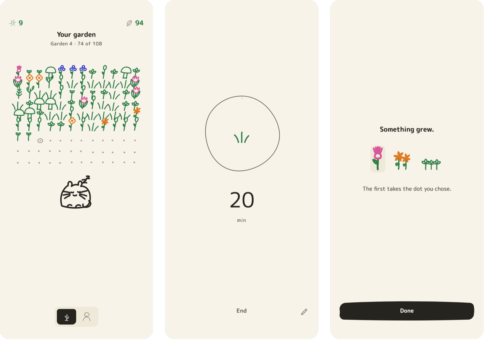
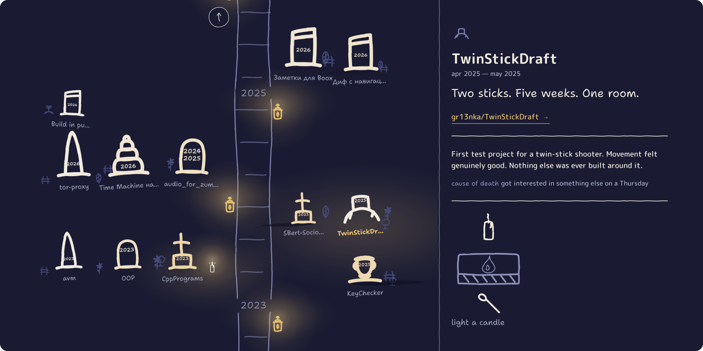
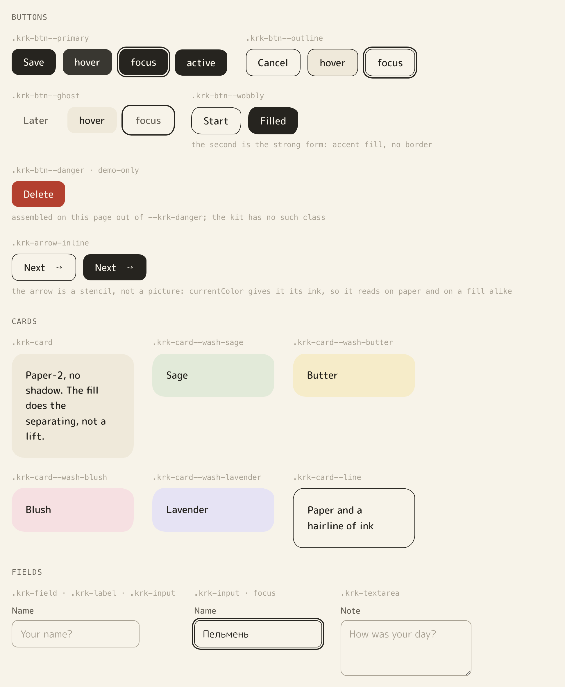
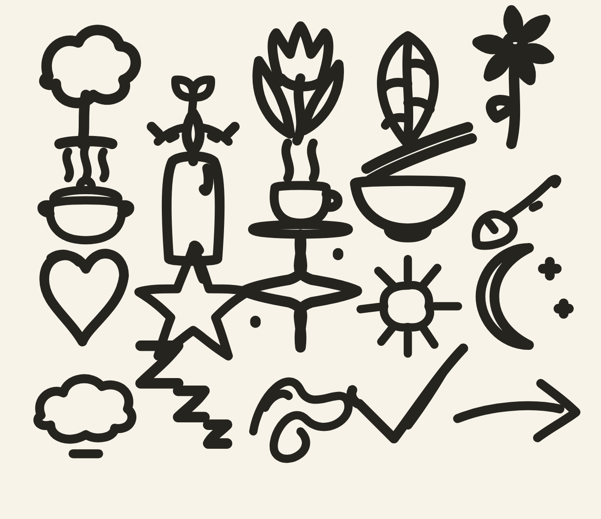
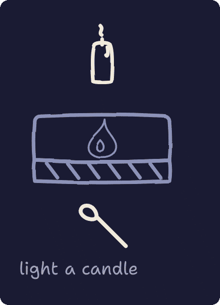

<div align="center">

# Karakuli


**Paper, one pen, and colour kept back for the moments that earn it.**

A hand-drawn design system for cosy software — trackers, journals, recipe apps, small games.





<sub><b>JustSit</b> keeps the default paper and spends its colour on the garden. <b><a href="https://github.com/gr13nka/Graveyard">Graveyard</a></b> (<a href="https://gr13nka.github.io/Graveyard/">live</a>) takes the same pen out at night — a palette the canon hasn't settled yet, done in the app rather than in the kit.</sub>

</div>

- Plain CSS. No build step, no dependencies, no framework.
- One warm cream paper, one warm ink, four pen brights that appear only at moments.
- A night ground too — every colour token carries both, so a token name means one thing.
- Everything drawn with a single soft round-nib pen — a motif library, and two characters.
- Lines that keep breathing, three canon entrances, and a quiet sound pack.
- Both typefaces carry full Cyrillic, so the system reads the same in Russian.

## See it

**[The whole system on one page →](https://gr13nka.github.io/karakuli/demo/)**

Or run it yourself:

```sh
git clone https://github.com/gr13nka/karakuli && cd karakuli
python3 -m http.server 8765
```

Open <http://127.0.0.1:8765/demo/index.html>. Ten plates: three phone screens, the palette,
the type ladder, the pen itself, every component in every state, the motion layer, the sound
board, the motifs and the characters. Use `http`, not `file://` — the page fetches its own
drawings.

<p align="center">
  
</p>

<div align="center"><sub>The same tokens at three points on the energy dial.</sub></div>

## Use it

```html
<link rel="stylesheet" href="web/tokens.css">
<link rel="stylesheet" href="web/karakuli.css">
<link rel="stylesheet" href="web/boil.css">   <!-- optional: living lines -->
<link rel="stylesheet" href="web/anim.css">   <!-- optional: entrances -->
```

```js
import './web/boil.js';                        // injects the boil filters, once per page
import { krkStagger } from './web/anim.js';
import { initKarakuliSound, KRK_CUES } from './web/sound.js';
import { initKarakuliTheme } from './web/theme.js';

const krk = initKarakuliSound({ energy: 'calm' });
saveButton.addEventListener('click', () => krk.play(KRK_CUES.tap));

krkStagger(cardList, { mode: 'wave', step: 90 });   // one call after the children exist

const theme = initKarakuliTheme();                 // follows the OS until someone chooses
themeButton.addEventListener('click', () => theme.cycle());
```

Light and dark are one attribute on `<html>`: absent follows the operating system,
`data-theme="light"` and `data-theme="dark"` force one. Inline `NO_FLASH_SNIPPET` from
`theme.js` in your `<head>` before the stylesheets — a module import resolves after the
first paint, so it is always too late to stop the flash.

That's the whole setup. The fonts are two `<link>` tags — copy the `<head>` from
[demo/index.html](demo/index.html). Sound resolves `uisfx` from npm if you have a bundler
and from a CDN if you don't, so a plain page needs no install.

Reach for `KRK_CUES` names rather than raw cue names. `KRK_CUES.tap` is `'press'`: uisfx has
no `'click'` cue, and asking for one plays silence.

## Make it yours

Karakuli is one system shared across several apps, and it stays one by keeping the number of
things an app may change very small. There are exactly three knobs — and the two apps above
are what they look like turned.

**Accent colour.** Override `--krk-accent` with one pen bright, or one signature colour of
your own. One per app, full stop. JustSit runs on the pen green its plants are drawn in;
Graveyard runs on the amber of its own lanterns.

**Wash choice.** Pick the one or two of the four washes the app actually uses for cards and
highlights. That choice is its temperature against its siblings. JustSit picks none of them:
its cards sit on plain paper-2, which leaves every scrap of colour on the page for the garden.

**Energy dial.** How much hand-drawn texture it carries. A journal uses fewer doodles and
more open space, close to a quiet notebook page; a habit garden can lean into dotted grids,
motif sprinkles and colour moments.

Everything else — palette values, the type scale, the stroke rules, the six sanctioned
hand-drawn touches, the motion spec — is fixed. If a screen needs something outside those
three knobs to feel right, that's a signal to revisit the system, not to quietly fork it.
Graveyard needed exactly that and says so: its night palette is a whole token override, which
is why it lives in the app and is written down here as unfinished business rather than shipped
as a second theme.

## The parts

<p align="center">
  
</p>

| Path | |
|---|---|
| `web/tokens.css` | Every colour, size and space. **The file you edit** |
| `web/karakuli.css` | Components — buttons, cards, fields, choices, tabs, lists, nav |
| `web/anim.css` · `anim.js` | The three entrances, and the invitation pulse |
| `web/boil.css` · `boil.js` | The living line |
| `web/sound.js` | The sound layer, over uisfx |
| `web/theme.js` | Light and dark, and the snippet that stops the flash |
| `doodles/` | The motif library — one canvas, one stroke width, `currentColor` |
| `characters/` | Пельмень and Батон |
| `compose/` | The Android mapping |
| `poster/` | The print arm, which is allowed to be louder than the UI |
| `demo/index.html` | The showcase |
| `docs/screenshots/` | The pictures on this page — regenerated, not drawn by hand |
| `STYLE.md` | The rules, and why they exist |
| `DECISIONS.md` | What was decided, what was rejected, and what is still open |
| `tools/` | The drift checker, and the script that takes these screenshots |

## Type

**M PLUS Rounded 1c** for everything the interface says; its rounded terminals don't argue
with the pen. **Shantell Sans** for the things it says by hand. Both carry full Cyrillic.

The hand face is an accent and never body text — a greeting, a caption, one word on a screen.
Set a paragraph in it and the page stops being cosy and starts being a birthday card.

## Two rules worth knowing

<p align="center">
  
</p>

**The wobble lives in the path data.** Stroke-only, round caps and joins, cubic curves, no
perfect circles and no ruler-straight lines — and the tremble, 2–4% of the canvas, is written
into the coordinates themselves. Never fake it with a runtime filter over exact geometry. The
boil filter is a *second* layer that makes an already-hand-drawn line breathe, and it displaces
about two pixels, so under roughly 40px it does nothing at all.

**Colour is spent, not used.** Paper and ink carry every screen — cream and warm ink by
day, indigo and chalk at night, one `light-dark()` pair per token so a name never means two
things; the pen brights turn up at
rewards, first runs and celebrations, and only ever as the edge of a stroke. Fill happens
exactly twice in the whole system: a UI surface drawn as a path and filled in the accent, and
a doodle's closed subpaths filled with **paper** where motifs overlap in a field. The fill is
always the ground and never a pen — which is why a garden of overlapping drawings still reads
as ink on paper rather than as a colouring book.

<p align="center">
  
  <br>
  <sub>Graveyard spending its one colour, on the one action the page is for.</sub>
</p>
